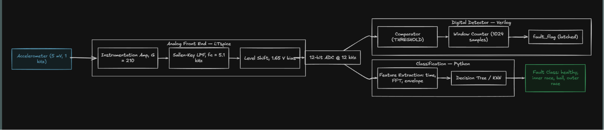
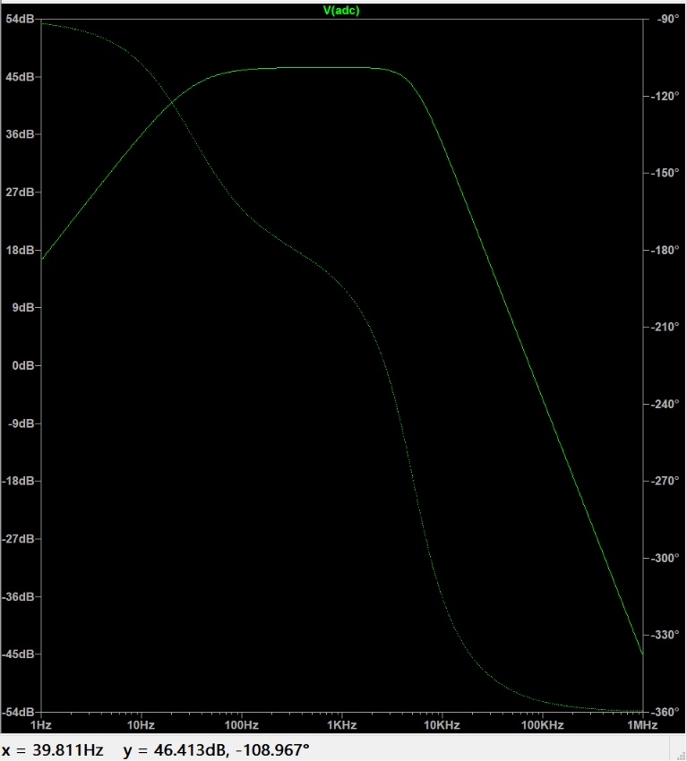
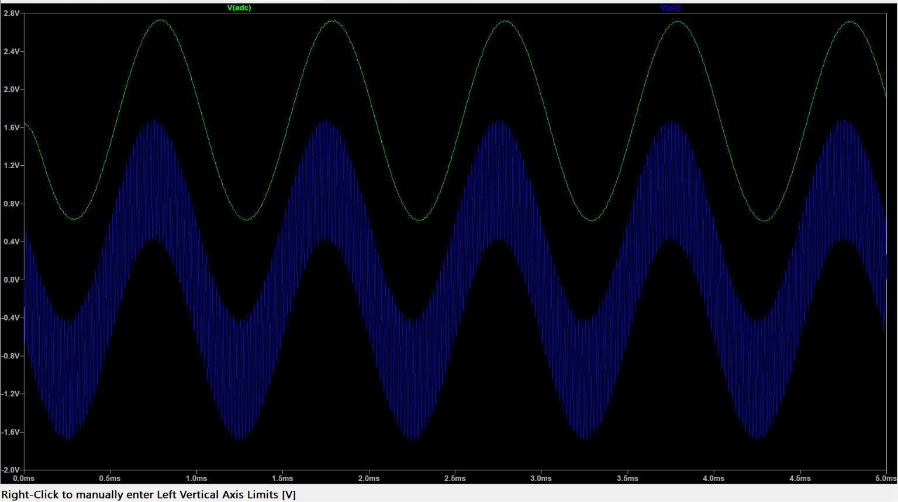
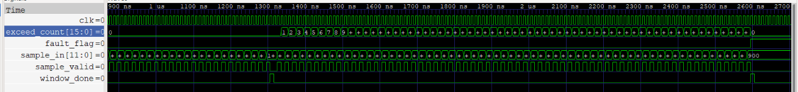
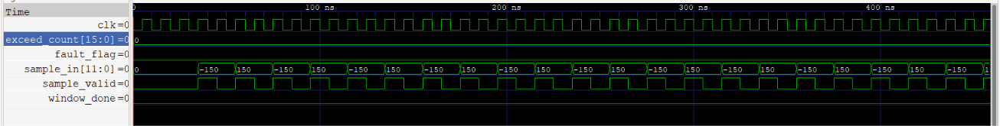
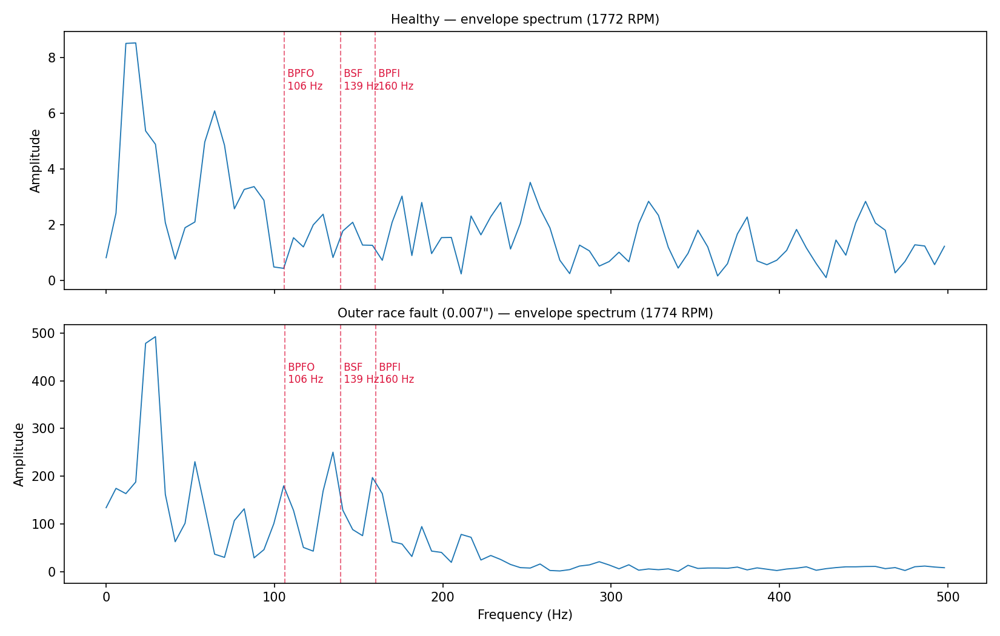
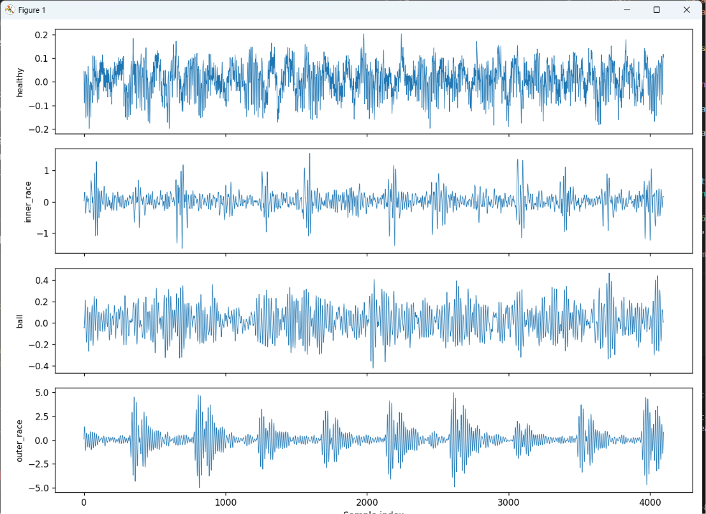
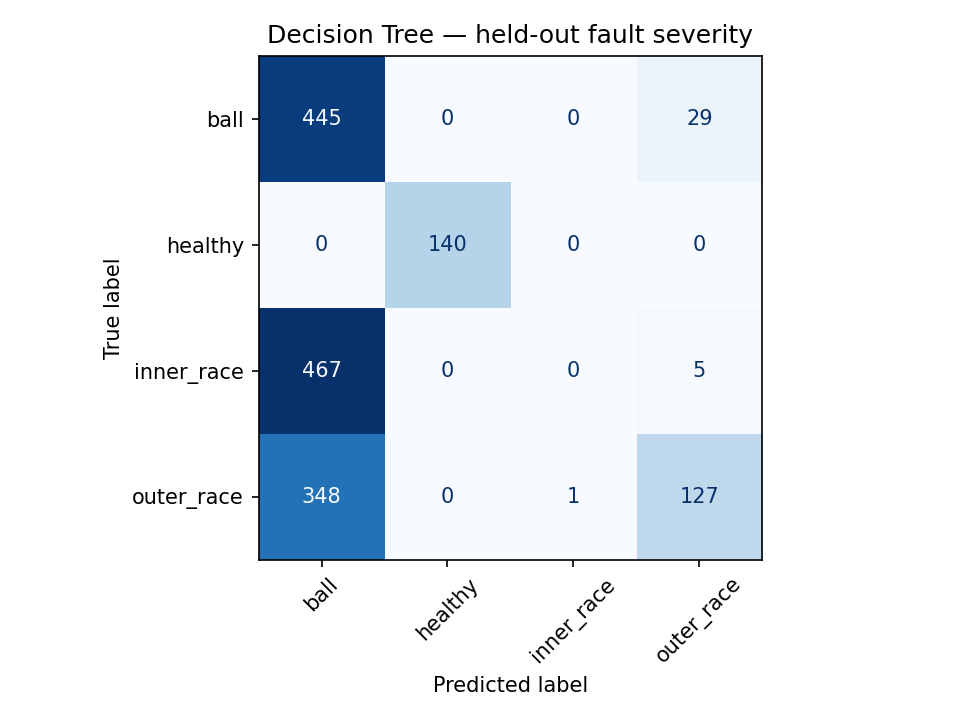
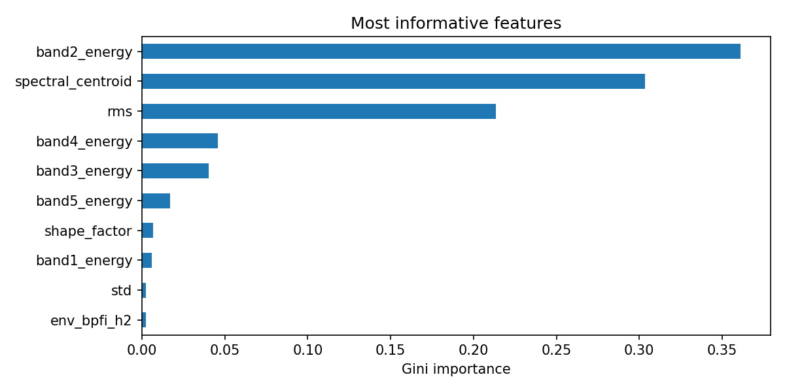

# Smart Motor Health Monitoring System

An end-to-end motor fault detection pipeline spanning analog signal conditioning, digital threshold detection, and machine learning classification — modelling the complete sensor-to-insight chain used in industrial condition monitoring.

**Stack:** LTspice · Verilog · Python (NumPy, SciPy, scikit-learn)

---

## Overview



The analog and digital stages give low-latency detection suitable for embedded hardware. The ML stage adds diagnosis — which fault, not just whether one exists — that a fixed threshold cannot provide.

---

## 1. Analog Signal Conditioning

`analog/signal_conditioning.cir`

### Instrumentation amplifier

Three-op-amp topology, chosen for high input impedance and common-mode rejection — both critical for a low-amplitude differential sensor signal.

```
Stage 1 (dual buffer with gain):  G1 = 1 + 2·R1/Rg = 1 + 2(10k/1k) = 21
Stage 2 (difference amplifier):   G2 = R4/R3 = 10k/1k = 10
Total gain:                       G  = 210
```

A 5 mV sensor signal becomes ≈1.05 V, using most of the ADC range without risking saturation.

### Anti-aliasing filter

Second-order Butterworth, unity-gain Sallen-Key.

```
fc = 1 / (2π·R·√(C1·C2)) = 1 / (2π·22k·√(2n·1n)) = 5.12 kHz
Q  = 0.5·√(C1/C2) = 0.707
```

The dataset is sampled at 12 kHz (Nyquist = 6 kHz), so a 5.1 kHz cutoff attenuates content above Nyquist while preserving the bearing fault frequencies of interest.

### Level shift

1 µF AC coupling followed by a 10k/10k divider from the 3.3 V rail sets a 1.65 V bias. Output swings 0.6–2.7 V, inside the 0–3.3 V ADC window with headroom at both ends.

### Results

| Metric | Design target | Simulated |
|---|---|---|
| Passband gain | 46.4 dB (×210) | ≈ 46 dB |
| −3 dB cutoff | 5.12 kHz | ≈ 5 kHz |
| Stopband rolloff | −40 dB/decade | −40 dB/decade |



Transient test: a 5 mV / 1 kHz signal with 3 mV of 50 kHz interference superimposed. At the amplifier output the interference is still present; after the filter it is fully attenuated, leaving a clean 1 kHz sinusoid centred at 1.65 V.



---

## 2. Digital Fault Detection

`rtl/fault_detect.v`, `rtl/tb_fault_detect.v`

A parameterised module that counts, within a fixed window of samples, how many exceed an amplitude threshold. If that count crosses a limit, `fault_flag` is asserted and latched until reset.

**Design decisions**

- **Window counting rather than per-sample thresholding.** A single spike is more likely to be a mechanical impact or electrical transient than a bearing fault; requiring sustained exceedances suppresses false alarms.
- **Latched output.** The flag stays asserted until an explicit reset, so a slower supervisory system cannot miss the event.
- **Non-overlapping windows.** A sliding window would need a sample buffer; fixed windows keep the design to two counters and a comparator, which matters for area on an FPGA.

**Verification**

The testbench drives two windows and checks the flag in both directions — no assertion on ±150 samples (below threshold), assertion on ±900 samples (above threshold).



Sample-level detail showing the valid/data handshake:



```bash
cd rtl
iverilog -o sim fault_detect.v tb_fault_detect.v
vvp sim
gtkwave waves/fault.vcd
```

**Threshold selection.** `THRESHOLD` is not arbitrary. Measured across the dataset, the healthy 99th-percentile RMS is 0.072 g and the faulty 1st-percentile RMS is 0.095 g, giving a decision boundary of roughly **0.084 g**. Referred through the analog gain of 210 and a 12-bit ADC spanning 3.3 V, this sets the threshold count used in the RTL.

---

## 3. Feature Extraction and Classification

`ml/features.py`, `ml/train.py`

Each recording is split into 2048-sample windows with 50% overlap, giving 4735 windows across ten recordings.

### Features (30 per window)

| Group | Features |
|---|---|
| Time domain | RMS, peak, peak-to-peak, standard deviation, kurtosis, skewness, crest / shape / impulse factor |
| Frequency domain | Three dominant spectral peaks (frequency and amplitude), energy in five bands, spectral centroid |
| Envelope spectrum | Normalised energy at BPFO, BPFI, BSF and FTF, plus second harmonics |

The envelope features are the physically motivated ones. A bearing defect does not put energy at its characteristic frequency directly — it excites a high-frequency structural resonance which is then amplitude-modulated at the defect repetition rate. Demodulating with the Hilbert transform recovers that rate, so energy at BPFO, BPFI or BSF points to a specific defect location rather than to general vibration.

For the SKF 6205 drive-end bearing at 1772 RPM (fr = 29.5 Hz):

| Frequency | Multiplier | Value |
|---|---|---|
| BPFO (outer race) | 3.585 × fr | 105.9 Hz |
| BPFI (inner race) | 5.415 × fr | 159.9 Hz |
| BSF (ball) | 4.714 × fr | 139.2 Hz |





The raw traces already show why the problem is tractable: the outer-race fault produces clear periodic impacts at roughly ten times the healthy amplitude, while the healthy signal is broadband and unstructured.

### Evaluation

Two splits were used, and the difference between them is the main result.

**Within-severity split** — each recording divided chronologically, 70% train / 30% test, with a gap at the boundary so no test window shares samples with a training window.

| Model | Accuracy |
|---|---|
| Decision Tree | 0.996 |
| KNN | 1.000 |

**Held-out severity split** — trained on 0.007″ and 0.014″ defects, tested on 0.021″, a defect size never seen in training.

| Model | Accuracy |
|---|---|
| Decision Tree | 0.456 |
| KNN | 0.299 |



The near-perfect first result is misleading. Each fault class is drawn from a single recording, so class and recording are the same thing, and the classifier can separate them on amplitude alone: healthy RMS averages 0.066 g against 0.600 g for the outer-race fault. The most important features confirm this — band energy, spectral centroid and RMS all scale with defect severity rather than describing defect type.

The second split removes that shortcut and accuracy collapses; inner-race faults are missed entirely at the unseen severity. This is the honest measure of what the model has learned: it discriminates fault magnitude well and fault mechanism poorly.



Closing that gap would require amplitude-invariant features (dimensionless ratios and normalised envelope energies rather than raw magnitudes), order tracking to normalise for shaft speed, and training data spanning multiple loads and severities per class.

---

## Dataset

Case Western Reserve University Bearing Data Center — 12 kHz drive-end accelerometer data, 1 HP load, ≈1772 RPM.

| Condition | Recordings |
|---|---|
| Healthy baseline | `Time_Normal_1_098` |
| Inner race | `IR007_1_110`, `IR014_1_175`, `IR021_1_214` |
| Ball | `B007_1_123`, `B014_1_190`, `B021_1_227` |
| Outer race (6 o'clock) | `OR007_6_1_136`, `OR014_6_1_202`, `OR021_6_1_239` |

Data files are not tracked in this repository. Download from the [CWRU Bearing Data Center](https://engineering.case.edu/bearingdatacenter) and place them in `data/`.

---

## Repository structure

```
analog/   LTspice netlist and simulation plots
docs/     Pipeline diagram
ml/       Feature extraction, training, plots
rtl/      Verilog RTL, testbench, waveform captures
data/     Dataset (not tracked)
```

## Running

```bash
pip install -r requirements.txt

python ml/features.py       # builds ml/features.csv
python ml/train.py          # trains, evaluates, writes plots
python ml/plot_envelope.py  # envelope spectrum comparison
```

Analog: open `analog/signal_conditioning.cir` in LTspice using the "All Files" filter. The `.ac` and `.tran` directives are at the end of the file — comment one out to run the other.

---

## Limitations

- **Analog.** Op-amps are modelled as ideal voltage-controlled voltage sources to verify the design values independently of device non-idealities. A physical build would need a precision op-amp such as the LT1013 with ±5 V supplies, and would have to account for input offset voltage, finite gain-bandwidth product, and resistor tolerance — the last being the dominant limit on CMRR in a discrete instrumentation amplifier.
- **Digital.** The RTL is verified against synthetic stimulus in simulation. It has not been synthesised, timing-closed, or run on hardware.
- **Classifier.** The healthy class has only one recording, so it is evaluated on a chronological split rather than a held-out severity, making its result less strict than the three fault classes. Test-set class counts are also unbalanced (140 healthy against ≈475 per fault class), so per-class metrics are more informative than overall accuracy.
- **Integration.** The three stages are validated individually against recorded data. The analog output has not been fed into the RTL as a sample stream, so the pipeline is modular rather than co-simulated end to end.